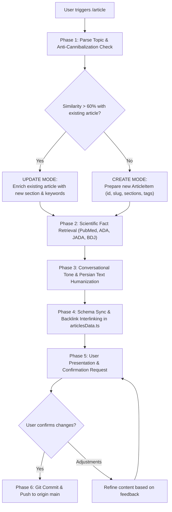

# Article Agent Runbook (`/article`)

This skill equips the agent to autonomously generate or update article subpages for the Shahid Gholipour Dental Clinic platform (`gholipour-dental-clinic`).

Whenever the user invokes `/article <topic>` (with or without extra explanation or notes), follow the 6-phase procedure below.

---

## Operational Architecture

---

## Phase 1: Input Analysis & Anti-Cannibalization Check

1. **Read Existing Articles**: Read [`src/data/articlesData.ts`](file:///c:/Users/mahdi/OneDrive/Desktop/%DA%A9%D9%84%DB%8C%D9%86%DB%8C%DA%A9%20%D8%AF%D9%86%D8%AF%D8%A7%D9%86%D9%BE%D8%B2%D8%B4%DA%A9%DB%8C%20%D8%B4%D9%87%DB%8C%D8%AF%20%D9%82%D9%84%DB%8C%20%D9%BE%D9%88%D8%B1/src/data/articlesData.ts) to examine all existing titles, slugs, summaries, and keywords.
2. **Semantic Overlap Audit**:
   - Compare the new topic against existing articles to prevent **keyword cannibalization** (as established in [SEO & Search Spec](./references/seo_and_search_spec.md)).
   - **Update Mode**: If the topic overlaps substantially (> 60% search intent) with an existing article, do NOT create a competing thin subpage. Instead, expand the existing article:
     - Add a new dedicated section with an anchor `#id`.
     - Update its keywords, summary, and date.
   - **Create Mode**: If the topic represents a distinct search intent, prepare a new standalone subpage with:
     - Next sequential `id`
     - English kebab-case `slug` (e.g. `clear-aligners-vs-braces`)
     - Clinic `category`
3. **Title Optimization & SEO Refinement**:
   - The agent is **explicitly authorized and encouraged to adjust/refine the raw user topic title** to improve organic search visibility (SEO) and click-through rates, while perfectly reflecting the detailed article content.
   - *Example*: A plain topic `"تفاوت لمینت و کامپوزیت"` can be refined to `"لمینت سرامیکی یا کامپوزیت دندان؟ مقایسه کامل ماندگاری، هزینه و زیبایی لبخند"`.
   - The headline should remain honest, reassuring, and aligned with user search intent.

---

## Phase 2: Scientific Fact-Finding (Medical Literature Only)

1. **Approved Literature Only**:
   All medical and dental claims must be sourced strictly from verified peer-reviewed dental journals and health bodies (see [Scientific Sources Guide](./references/scientific_sources.md)):
   - PubMed / MEDLINE (`pubmed.ncbi.nlm.nih.gov`)
   - American Dental Association (`ada.org`)
   - Journal of the American Dental Association (JADA)
   - British Dental Journal (BDJ)
   - Cochrane Oral Health Library
   - FDI World Dental Federation
   - Academic textbooks and clinical consensus statements
2. **Strictly Prohibited**:
   - Commercial dental clinic marketing blogs, SEO content farms, forums, and unverified summaries.
3. **Execution**:
   - Use `search_web` targeting verified domains (e.g. `site:pubmed.ncbi.nlm.nih.gov <topic>`).
   - Extract clinical success rates, recovery durations, contraindications, and evidence-based home-care steps.

---

## Phase 3: Conversational Tone & Text Humanization

1. **Target Audience**: Everyday patients and families—NOT medical professionals.
2. **Tone Guidelines** (see [Tone and Humanization Guide](./references/tone_and_humanization.md)):
   - **Warm & Empathetic**: Acknowledge patient anxieties, fear of pain, or cost concerns immediately.
   - **Simple Everyday Persian**: Replace academic jargon with daily conversational terms (e.g., use *«عصب دندان»* instead of *«پالپ دندان»*, *«کشیدن دندان»* instead of *«اکستراکشن»*). If technical terms are necessary, explain them in plain language in parentheses.
   - **Zero AI Clichés**: Ban formulas such as *«در این مقاله قصد داریم...»*, *«بر هیچ‌کس پوشیده نیست...»*, *«امروزه سلامت دندان اهمیت بالایی دارد...»*. Start directly with an engaging patient scenario or question.

---

## Phase 4: Technical SEO, Data Schema Sync & Internal Linking (Backlinks)

1. **Format into `ArticleItem`**:
   - `id`: Unique incremental ID
   - `slug`: Clean kebab-case string
   - `title`: Catchy, friendly Persian title (included in dynamic `<title>` and Open Graph)
   - `category`: Matching clinic specialty
   - `readTime`: e.g. `'۵ دقیقه'`
   - `date`: Current Persian Shamsi date (e.g. `'۶ مهر ۱۴۰۵'`)
   - `author`: Fixed author & medical reviewer: `'دکتر مهدی محمد نژاد'` (دکترای حرفه‌ای دندان‌پزشکی کلینیک شهید قلی‌پور | کد نظام پزشکی: ۲۲۹۳۵۳)
   - `image`: Relative asset path (e.g. `'/assets/article-implant-dos-donts.jpg'`). Priority 1: Check existing `public/assets/` images. Priority 2: Generate a realistic dental graphic with `generate_image` (aspectRatio `'16:9'`). Placed immediately after title with responsive hero styling.
   - `imageAlt`: Descriptive Persian alt text for SEO and accessibility
   - `imageCaption`: Engaging Persian caption explaining the clinical graphic
   - `summary`: 2–3 sentence engaging hook and search meta description (120–160 characters, natural keyword integration)
   - `keywords`: 8–15 high-volume search keywords and colloquial symptoms (e.g., `دندون درد`, `ورم صورت`, `عصب کشی بدون درد`)
   - `sections`: 3–5 structured sections, each with a unique kebab-case anchor `id` (for MiniSearch deep-linking), `title`, and rich `body`
   - `faqs`: 2–4 high-intent patient FAQs (`{ question: string, answer: string }`) written in warm conversational Persian, addressing top patient questions and fueling Google's `FAQPage` rich snippets and People Also Ask boxes.
   - `content`: Array of section texts for backward compatibility
2. **Featured Editorial Image Workflow**:
   - **Step 1 (Priority)**: Scan `public/assets/` for an existing relevant dental image (e.g., `article-implant-dos-donts.jpg`, `article-whitening.jpg`, `article-toothpaste.jpg`, `article-orthodontics.jpg`, `article-anesthesia.jpg`).
   - **Step 2 (Creation)**: If no matching asset exists, use the `generate_image` tool with aspectRatio `'16:9'` and a photorealistic medical dental prompt to generate the asset into the clinic image repository.
   - **Step 3 (Placement)**: Assign `image`, `imageAlt`, and `imageCaption` in `ArticleItem`. The page renders it as an editorial 16:9 hero image directly beneath the title and header metadata.

3. **Author E-E-A-T & Reviewer Persona**:
   - Author is always set to **`دکتر مهدی محمد نژاد`** (Doctor of Dental Surgery, Gholipour Dental Clinic | Medical Council Code: ۲۲۹۳۵۳).
   - Injects both author bio credentials card (displaying portrait `/assets/doctor-mohammadnezhad.jpg` and code ۲۲۹۳۵۳) and structured schema markup (`author`, `reviewedBy`, with `identifier: "229353"`) to establish strong Google E-E-A-T and medical trust.

4. **Technical SEO & Schema Integration**:
   - Verify that the new slug automatically pre-renders via `generateStaticParams()` in `src/app/articles/[slug]/page.tsx`.
   - Verify dynamic metadata generation (`generateMetadata`): unique title, meta description, canonical URL, and Open Graph tags (including `og:image`).
   - Verify JSON-LD structured data: `MedicalWebPage`, `BreadcrumbList`, and `FAQPage`.
3. **Internal Linking (Hub & Spoke)**:
   - Identify 1–2 related articles in `src/data/articlesData.ts`.
   - Update their section text to cross-reference the new article with natural markdown anchor context (`[متن پیوند](/articles/slug#anchor)`).
4. **Save**: Update [`src/data/articlesData.ts`](file:///c:/Users/mahdi/OneDrive/Desktop/%DA%A9%D9%84%DB%8C%D9%86%DB%8C%DA%A9%20%D8%AF%D9%86%D8%AF%D8%A7%D9%86%D9%BE%D8%B2%D8%B4%DA%A9%DB%8C%20%D8%B4%D9%87%DB%8C%D8%AF%20%D9%82%D9%84%DB%8C%20%D9%BE%D9%88%D8%B1/src/data/articlesData.ts).

---

## Phase 5: Presentation & User Review

Output a clean, structured summary for the user to analyze:
- **Decision Mode**: New Article created vs Existing Article enriched (with similarity reasoning).
- **Scientific References Cited**: Exact medical journals and clinical sources used.
- **Article Metadata & Technical SEO**: Title (refined for SEO), Slug, Category, Keywords, Reading Time, Meta Description, and Author (`دکتر مهدی محمد نژاد`).
- **Featured Image**: Image path (found in assets or newly generated), Alt text, and Caption.
- **Section Breakdown**: Heading names, deep anchor IDs (`#id`), and content preview.
- **Patient FAQs**: List of 2–4 questions and answers prepared for `FAQPage` schema.
- **Backlinks / Internal Links Added**: Existing articles updated to link here.
- **Explicit Call-to-Action**: Prompt the user:
  > *"Please review the generated article structure, SEO metadata, and content above. If everything meets your approval, confirm and I will automatically commit and push to Git."*

---

## Phase 6: Git Commit & Push (On Confirmation)

When the user confirms approval:
1. Verify git status:
   `git status -s`
2. Stage and commit changes with a descriptive conventional commit message:
   `git add src/data/articlesData.ts` (and any related updated files)  
   `git commit -m "feat(articles): add article <slug> - <title>"`
3. Push to remote repository:
   `git push origin main`
4. Confirm successful push and provide commit hash to the user.
