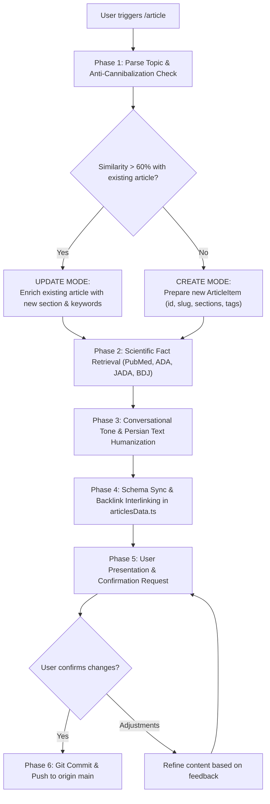

# Article Agent Runbook (`/article`)

This skill equips the agent to autonomously generate or update article subpages for the Shahid Gholipour Dental Clinic platform (`gholipour-dental-clinic`).

Whenever the user invokes `/article <topic>` (with or without extra explanation or notes), follow the 6-phase procedure below.

---

## Operational Architecture

---

## Phase 1: Input Analysis & Anti-Cannibalization Check

1. **Read Existing Articles**: Read [`src/data/articlesData.ts`](file:///c:/Users/mahdi/OneDrive/Desktop/%DA%A9%D9%84%DB%8C%D9%86%DB%8C%DA%A9%20%D8%AF%D9%86%D8%AF%D8%A7%D9%86%D9%BE%D8%B2%D8%B4%DA%A9%DB%8C%20%D8%B4%D9%87%DB%8C%D8%AF%20%D9%82%D9%84%DB%8C%20%D9%BE%D9%88%D8%B1/src/data/articlesData.ts) to examine all existing titles, slugs, summaries, and keywords.
2. **Semantic Overlap Audit**:
   - Compare the new topic against existing articles to prevent **keyword cannibalization** (as established in [SEO & Search Spec](./references/seo_and_search_spec.md)).
   - **Update Mode**: If the topic overlaps substantially (> 60% search intent) with an existing article, do NOT create a competing thin subpage. Instead, expand the existing article:
     - Add a new dedicated section with an anchor `#id`.
     - Update its keywords, summary, and date.
   - **Create Mode**: If the topic represents a distinct search intent, prepare a new standalone subpage with:
     - Next sequential `id`
     - English kebab-case `slug` (e.g. `clear-aligners-vs-braces`)
     - Clinic `category`
3. **Title Optimization & SEO Refinement**:
   - The agent is **explicitly authorized and encouraged to adjust/refine the raw user topic title** to improve organic search visibility (SEO) and click-through rates, while perfectly reflecting the detailed article content.
   - *Example*: A plain topic `"تفاوت لمینت و کامپوزیت"` can be refined to `"لمینت سرامیکی یا کامپوزیت دندان؟ مقایسه کامل ماندگاری، هزینه و زیبایی لبخند"`.
   - The headline should remain honest, reassuring, and aligned with user search intent.

---

## Phase 2: Scientific Fact-Finding (Medical Literature Only)

1. **Approved Literature Only**:
   All medical and dental claims must be sourced strictly from verified peer-reviewed dental journals and health bodies (see [Scientific Sources Guide](./references/scientific_sources.md)):
   - PubMed / MEDLINE (`pubmed.ncbi.nlm.nih.gov`)
   - American Dental Association (`ada.org`)
   - Journal of the American Dental Association (JADA)
   - British Dental Journal (BDJ)
   - Cochrane Oral Health Library
   - FDI World Dental Federation
   - Academic textbooks and clinical consensus statements
2. **Strictly Prohibited**:
   - Commercial dental clinic marketing blogs, SEO content farms, forums, and unverified summaries.
3. **Execution**:
   - Use `search_web` targeting verified domains (e.g. `site:pubmed.ncbi.nlm.nih.gov <topic>`).
   - Extract clinical success rates, recovery durations, contraindications, and evidence-based home-care steps.

---

## Phase 3: Conversational Tone & Text Humanization

1. **Target Audience**: Everyday patients and families—NOT medical professionals.
2. **Tone & Formatting Guidelines** (see [Tone and Humanization Guide](./references/tone_and_humanization.md)):
   - **Warm & Empathetic**: Acknowledge patient anxieties, fear of pain, or cost concerns immediately.
   - **Simple Everyday Persian**: Replace academic jargon with daily conversational terms (e.g., use *«عصب دندان»* instead of *«پالپ دندان»*, *«کشیدن دندان»* instead of *«اکستراکشن»*). If technical terms are necessary, explain them in plain language in parentheses.
   - **Zero AI Clichés**: Ban formulas such as *«در این مقاله قصد داریم...»*, *«بر هیچ‌کس پوشیده نیست...»*, *«امروزه سلامت دندان اهمیت بالایی دارد...»*. Start directly with an engaging patient scenario or question.
   - **Structured Lists & Neat Typography (MANDATORY)**:
     - Always use standard markdown numbered lists (`۱. `, `۲. `) for sequential steps/protocols so the parser renders them into semantic HTML `<ol>` elements.
     - Always use standard bullet items (`- `) for categorized tips, food recommendations, and symptom checklists so the parser renders them into clean semantic `<ul>` lists.
     - Use `### Subheading` for subsections so they render with colored accent indicators.
     - Never leave raw asterisk characters or irregular comma-separated run-on walls of text. Ensure bold markers (`**text**`) wrap terms tightly without spaces so they seamlessly render as styled `<strong>` elements.

---

87: ## Phase 4: Technical SEO, Data Schema Sync & Internal Linking (Backlinks)
88: 
89: 1. **Format into `ArticleItem`**:
90:    - `id`: Unique incremental ID
91:    - `slug`: Clean kebab-case string
92:    - `title`: Catchy, friendly Persian title (included in dynamic `<title>` and Open Graph)
93:    - `category`: Matching clinic specialty
94:    - `readTime`: e.g. `'۵ دقیقه'`
95:    - `date`: Current Persian Shamsi date (e.g. `'۶ مهر ۱۴۰۵'`)
96:    - `author`: Fixed author & medical reviewer: `'دکتر مهدی محمدنژاد'` (دکترای حرفه‌ای دندان‌پزشکی کلینیک شهید قلی‌پور | کد نظام پزشکی: ۲۲۹۳۵۳)
97:    - `image`: Relative asset path (e.g. `'/assets/article-implant-dos-donts.webp'`). Priority 1: Check existing `public/assets/` images. Priority 2: Generate a realistic dental graphic with `generate_image` (aspectRatio `'16:9'`). Placed immediately after title with responsive hero styling.
98:    - `imageAlt`: Descriptive Persian alt text for SEO and accessibility
99:    - `imageCaption`: Engaging Persian caption explaining the clinical graphic
100:    - `summary`: 2–3 sentence engaging hook and search meta description (120–160 characters, natural keyword integration)
101:    - `tldr`: 1–2 sentence expert executive summary (TL;DR) auto-drafted by agent for fast scanning and featured snippet optimization. Displayed in an alert card above the fold.
102:    - `keywords`: 8–15 high-volume search keywords and colloquial symptoms (e.g., `دندون درد`, `ورم صورت`, `عصب کشی بدون درد`)
103:    - `sections`: 3–5 structured sections, each with a unique kebab-case anchor `id` (for MiniSearch deep-linking), `title`, and rich `body`.
104:      - **Inline Physician Annotations (`doctorComment`)**: The agent identifies 1–2 critical sections (highest risk of overgeneralization or high chairside nuance) and prepares suggested clinical observation prompts or placeholder draft text `[نکته بالینی دکتر مهدی محمدنژاد: ...]` for Dr. Mahdi to review or customize.
105:    - `faqs`: 2–4 high-intent patient FAQs (`{ question: string, answer: string }`) written in warm conversational Persian, addressing top patient questions and fueling Google's `FAQPage` rich snippets and People Also Ask boxes.
106:    - `citations`: 2–4 peer-reviewed citations (`{ title, source, url?, doi? }`) referencing PubMed, JADA, ADA, or Cochrane to establish verified factual lineage and ground Google crawler trust.
107:    - `content`: Array of section texts for backward compatibility
108: 
109: 2. **Featured Editorial Image Workflow**:
110:    - **Step 1 (Priority)**: Scan `public/assets/` for an existing relevant dental image (e.g., `article-implant-dos-donts.webp`, `article-whitening.webp`, `article-toothpaste.webp`, `article-orthodontics.webp`, `article-anesthesia.webp`).
111:    - **Step 2 (Creation)**: If no matching asset exists, use the `generate_image` tool with aspectRatio `'16:9'` and a photorealistic medical dental prompt to generate the asset into the clinic image repository.
112:    - **Step 3 (Placement)**: Assign `image`, `imageAlt`, and `imageCaption` in `ArticleItem`. The page renders it as an editorial 16:9 hero image directly beneath the title and header metadata.
113: 
114: 3. **Author E-E-A-T & Reviewer Persona**:
115:    - Author is always set to **`دکتر مهدی محمدنژاد`** (Doctor of Dental Surgery, Gholipour Dental Clinic | Medical Council Code: ۲۲۹۳۵۳).
116:    - Injects both author bio credentials card (displaying portrait `/assets/doctor-mohammadnezhad.webp` and code ۲۲۹۳۵۳) and structured schema markup (`author`, `reviewedBy`, with `identifier: "229353"`) to establish strong Google E-E-A-T and medical trust.
117: 
118: 4. **Technical SEO & Schema Integration**:
119:    - Verify that the new slug automatically pre-renders via `generateStaticParams()` in `src/app/articles/[slug]/page.tsx`.
120:    - Dynamic metadata generation (`generateMetadata`): unique title, meta description, canonical URL, and Open Graph tags (including `og:image`).
121:    - Comprehensive JSON-LD structured data: `MedicalWebPage` (including `hasPart` for doctor comments and `citation` references), `BreadcrumbList`, and `FAQPage`.
122: 
123: 5. **Internal Linking (Hub & Spoke)**:
124:    - Identify 1–2 related articles in `src/data/articlesData.ts`.
125:    - Update their section text to cross-reference the new article with natural markdown anchor context (`[متن پیوند](/articles/slug#anchor)`).
126: 6. **Save to File**: Write updates to [`src/data/articlesData.ts`](file:///c:/Users/mahdi/OneDrive/Desktop/%DA%A9%D9%84%DB%8C%D9%86%DB%8C%DA%A9%20%D8%AF%D9%86%D8%AF%D8%A7%D9%86%D9%BE%D8%B2%D8%B4%DA%A9%DB%8C%20%D8%B4%D9%87%DB%8C%D8%AF%20%D9%82%D9%84%DB%8C%20%D9%BE%D9%88%D8%B1/src/data/articlesData.ts).
127: 
128: ---
129: 
130: ## Phase 5: Local Server Sync, Live Inspection & Doctor Review
131: 
132: 1. **Local Server Update & Build Verification**:
133:    - After updating `src/data/articlesData.ts`, ensure the local development environment or build has updated so Dr. Mahdi can immediately inspect the live article at:
134:      `http://localhost:3000/articles/<slug>`
135: 2. **Review Checklist for Dr. Mahdi**:
136:    - **TL;DR Box**: Check the agent-written 1–2 sentence summary at the top of the page.
137:    - **Inline Doctor Notes (`doctorComment`)**: Inspect suggested clinical commentary or provide custom chairside notes (30–60 words) for the marked sections.
138:    - **Scientific Citations**: Verify the cited PubMed/journal sources.
139:    - **Patient FAQs & Title**: Confirm conversational accuracy and patient tone.
140: 3. **Output Presentation**:
141:    Output a clean summary for Dr. Mahdi including:
142:    - Direct local test link: `http://localhost:3000/articles/<slug>`
143:    - Draft TL;DR text
144:    - Suggested `[doctorComment]` sections needing or containing doctor annotations
145:    - Citations list
146:    - Explicit prompt:
147:      > *"The local server has been updated with the new article. Please review the live page at http://localhost:3000/articles/<slug>. Check the TL;DR box, suggest or adjust your [doctor note], and confirm once you are satisfied so I can commit and push to Git."*
148: 
149: ---
150: 
151: ## Phase 6: Git Commit & Push (ONLY Upon Doctor Approval)
152: 
153: **Never commit or push without explicit approval from Dr. Mahdi.**
154: 
155: When the user confirms approval:
156: 1. If Dr. Mahdi provided adjustments to the TL;DR, content, or `doctorComment`, apply them first to `src/data/articlesData.ts`.
157: 2. Verify git status:
158:    `git status -s`
159: 3. Stage and commit changes with a descriptive conventional commit message:
160:    `git add src/data/articlesData.ts src/app/articles/ .agents/skills/article/`  
161:    `git commit -m "feat(articles): add article <slug> - <title> with doctor review and citations"`
162: 4. Push to remote repository:
163:    `git push origin main`
164: 5. Confirm successful push and provide commit hash to the user.
